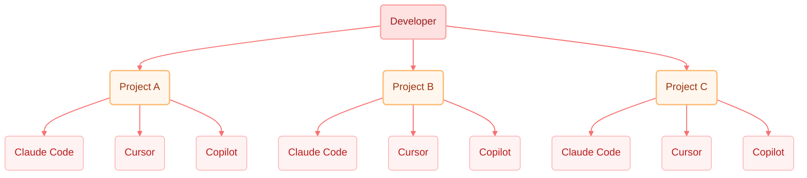
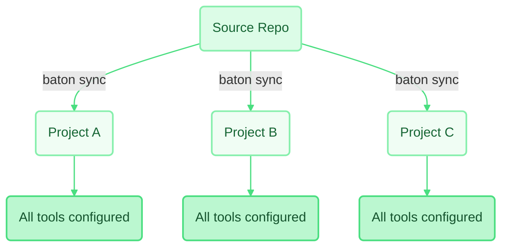

# Baton DX <sub>/bəˈtɑːn/</sub>

[](https://www.npmjs.com/package/@baton-dx/cli)
[](https://github.com/baton-dx/baton-dx/actions)
[](https://opensource.org/licenses/MIT)

**Baton is a CLI package manager for Developer Experience & AI configuration.** Manage Skills, Rules, Agents, Memory Files, and file configs as versioned, composable profiles for 14 AI coding tools.

## Why Baton?

| | Without Baton | With Baton |
|---|---|---|
| **Setup** | Manually copy and adapt config files for each AI tool | `baton init` + `baton sync` — done in seconds |
| **Team Consistency** | Config drift — every dev diverges over time | One source of truth, version-locked with `baton.lock` |
| **Cross-Project** | Each repo has its own ad-hoc AI configs, no shared standard | Same profiles across all your projects — consistent by default |
| **Multiple Tools** | Even 2–3 AI tools mean 2–3 different formats to maintain | One manifest, automatically transformed per tool |
| **Onboarding** | New devs spend hours recreating the "right" AI setup | `baton sync` — match the team instantly |

**Without Baton** — manual config per project, per tool:



**With Baton** — one source, every project in sync:



Baton currently supports 14 AI coding tools — see the [full list below](#supported-ai-tools).

## Quick Start

```bash
# Install
bun install -g @baton-dx/cli

# Connect your team's source repository
baton source connect github:your-org/dx-configs --name my-team

# Initialize in any project
baton init

# Sync all configurations
baton sync
```

## Features

- **Unified AI Configuration** — One manifest for 14 AI coding tools
- **MCP Server Distribution** — Define MCP servers once, placed into each tool's native config format
- **Profile Inheritance** — Compose profiles with `extends` for layered configuration
- **Smart Sync** — Transform and place files in the correct format for each tool
- **Version Control** — Lockfile-based reproducibility with SHA-256 integrity
- **Merge Strategies** — replace, deep, append, prepend, skip, prompt, directory, import
- **Auto-Detection** — Automatically detect installed AI tools and IDEs
- **Scaffold Templates** — Bootstrap source repositories with `baton source create`

## Supported AI Tools

| Tool | Key | Tool | Key |
|------|-----|------|-----|
| Claude Code | `claude-code` | OpenCode | `opencode` |
| Cursor | `cursor` | Amp | `amp` |
| Windsurf | `windsurf` | Kiro | `kiro` |
| Antigravity | `antigravity` | Zed | `zed` |
| Codex CLI | `codex` | Cline | `cline` |
| GitHub Copilot | `github-copilot` | Roo | `roo` |
| Junie | `junie` | Trae | `trae` |

## Official Source Repository

Baton's own configurations are published as [`baton-dx-source`](https://github.com/baton-dx/baton-dx-source) — a real-world example of sources and profiles in action:

| Profile | Command | Audience |
| ------- | ------- | -------- |
| **maintainer** | `baton init --profile github:baton-dx/baton-dx-source/maintainer` | Contributors to this repo |
| **creator** | `baton init --profile github:baton-dx/baton-dx-source/creator` | Developers building their own sources and profiles |
| **consumer** | `baton init --profile github:baton-dx/baton-dx-source/consumer` | Developers using Baton in their projects |

## Documentation

- [Installation](docs/01-installation.md) — Prerequisites and install methods
- [Quick Start Guide](docs/02-quickstart.md) — Get running in 5 minutes
- [Creating Sources](docs/03-creating-sources.md) — Build source repositories
- [Creating Profiles](docs/04-creating-profiles.md) — Design profile manifests
- [Using Profiles](docs/05-using-profiles.md) — Use profiles in your projects
- [CLI Reference](docs/06-cli-reference.md) — Complete command reference
- [Configuration Reference](docs/07-configuration-reference.md) — All config file schemas
- [AI Tools Reference](docs/08-ai-tools-reference.md) — All 14 supported AI tools
- [IDE Platforms](docs/09-ide-platforms-reference.md) — Supported IDE platforms
- [Merge Strategies](docs/10-merge-strategies.md) — Deep dive into merge strategies

## Built with AI, Verified by Humans

Baton is proudly built with the help of AI tools. We believe AI-assisted development is a powerful accelerator — and as a tool that manages AI coding configurations, we practice what we preach. At the same time, human review, testing, and judgment are essential for every contribution. We do not accept pull requests from fully autonomous bots (e.g., OpenClaw).

## Contributing

See [Contributing Guide](docs/11-contributing.md) for development setup, coding conventions, and PR workflow.

## License

MIT © 2026 Baton Contributors
